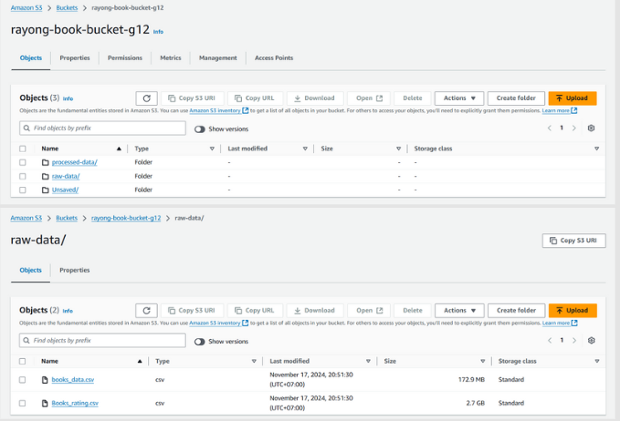
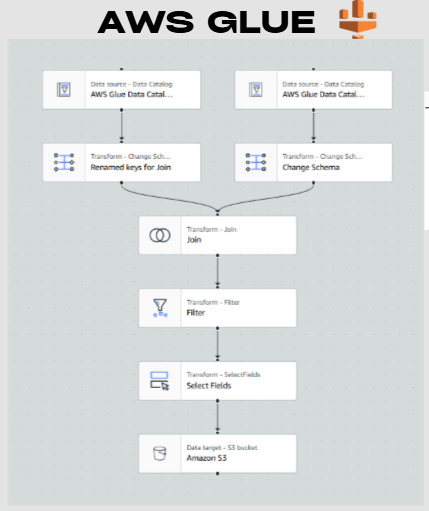
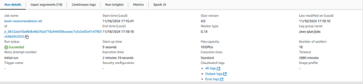
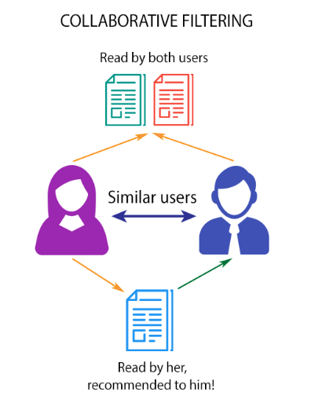
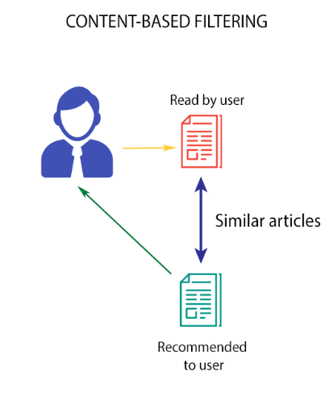
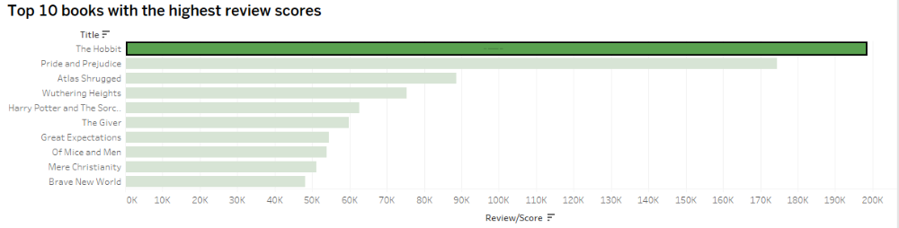
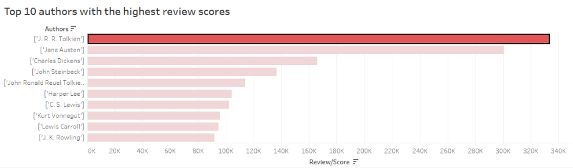
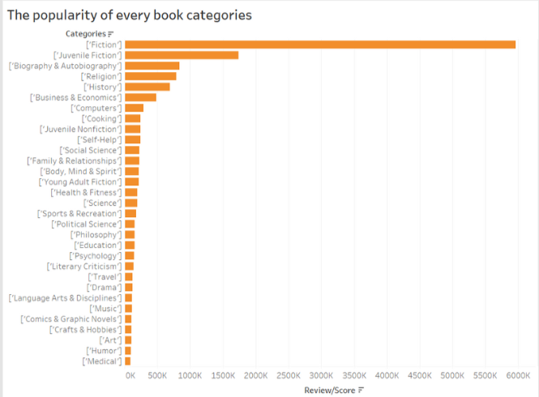
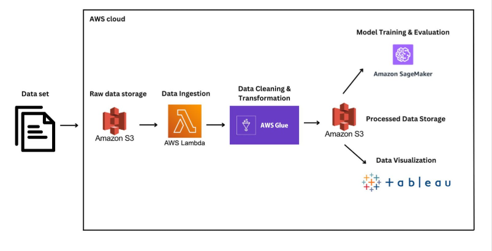
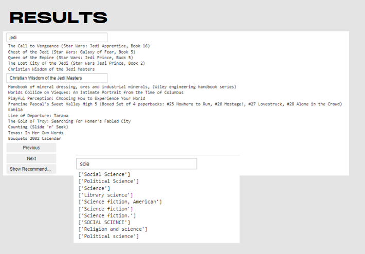

# 📚 Book Recommendation System using Big Data Technologies on AWS

> 🛠️ This project was implemented entirely on **AWS**, allowing us to showcase the full **workflow**, **pipeline**, and **processing steps** of building a large-scale recommendation system using real-world cloud infrastructure.

---

## 📌 Overview & Background

Our project, **"Book Recommendation System,"** is designed to help readers discover books that match their preferences using the **Amazon Book Reviews dataset**. By leveraging powerful **AWS services** such as:

- Amazon S3
- AWS Glue
- AWS Lambda
- Amazon SageMaker

We constructed a **scalable**, **automated**, and **hybrid recommendation engine** that integrates **machine learning** with **big data processing pipelines**.

---

## ❓ Problem Statement

Building a book recommendation system at scale presents several core challenges:

- 🔍 Extracting **meaningful insights** from vast volumes of **unstructured review data**.
- 🧠 Designing a system that **adapts to dynamic user preferences** and behaviors.
- ⚙️ Balancing **recommendation accuracy** with **computational efficiency** across large datasets.

---

## 📂 Dataset

- **Source**: Kaggle – Amazon Book Reviews  
- **Size**: ~1 GB  
- **Type**: JSON format with user reviews, ratings, book metadata

### 📸 Sample Data Preview  

---

## ☁️ Related Big Data Technologies on AWS

### 🗃️ Amazon S3  
Bucket: `rayong-book-bucket-g12`  
Used for storing raw datasets and intermediate results.

---

### 🧬 AWS Lambda  
Function name: `rayong-lambda-g12`  
Used to automate ETL trigger, notifications, preprocessing, and model execution.  
Scripts:
- `glue_trigger.py`
- `notify.py`
- `preprocessing.py`
- `sagemaker_train.py`
- `lambda_function.py`

---

### 🔄 AWS Glue  
Job: `book-recommendation-etl`  
Performs data cleaning, feature extraction, and schema transformation.

---

### 🤖 Amazon SageMaker  
Trains and deploys the machine learning models.

#### 📗 Collaborative Filtering  
Recommends items based on **user behavior**.  
Two types:

- **User-Based CF**  
  > Uses similarity between users  
- **Item-Based CF**  
  > Uses similarity between items  

**Matrix-based approach** using user-item interaction.

---

#### 📘 Content-Based Filtering  
Recommends items using **item metadata** and user history.  
Features:
- Description
- Authors
- Categories
- Sentiment Score (NLP)

Steps:
- Create item profiles using features
- Match user preferences to content vectors

---

#### 🔀 Hybrid Approach  
Combines both Collaborative & Content-Based filtering.  
Advantages:
- More **personalized**
- Better **coverage**
- Reduced **cold-start problems**

---

## 📊 Tableau Visualization  
We used Tableau to visualize and explore data insights, supporting business intelligence (BI) analysis for the recommendation system.

Our visualizations include:

📚 Top 10 Books with the highest average review scores

✍️ Top 10 Authors based on average review scores

📈 Popularity of Book Categories, showing how frequently each category appears in the dataset

---

## 🧩 Workflow Summary  
> A complete end-to-end pipeline using AWS Big Data Ecosystem:

1. **Upload raw data** to S3
2. **Preprocess** with AWS Glue
3. **Trigger Lambda** to start ETL + training pipeline
4. **Train ML models** using SageMaker (Collaborative + Content-based)
5. **Generate recommendations**
6. **Visualize** results in Tableau

---

## ✅ Key Features
- Real-time, scalable recommendation pipeline
- Uses hybrid recommender strategy
- Fully serverless infrastructure
- Clean, modular code structure

---

## 📎 Credits
Team G12 – Big Data Analytics
Instructor: DR. APICHON WITAYANGKURN 
Dataset: Kaggle Amazon Book Reviews

---

## 📬 Contact  
For any questions or collaborations:  
📧 anakinpalinyot@gmail.com

---

